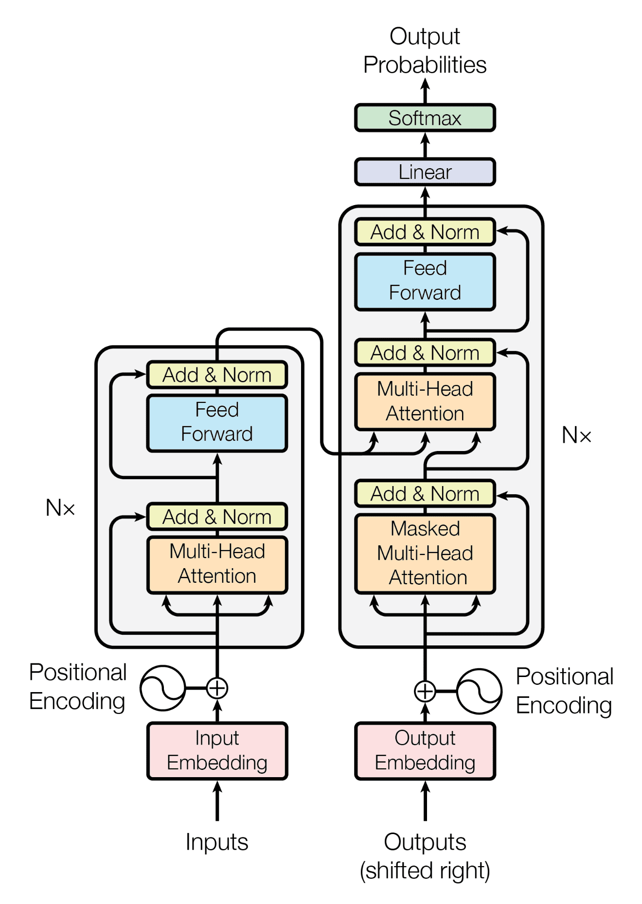

# GPT-2 Model Architecture

## 1. Transformer Model Architecture



## 2. GPT-2 Model Architecture Change

### 2.1 No encoder

TBD

### 2.2 Layer normalization before attention and FFN

In the original transformer paper, layer norm happens after each sub layer
```text
x -> (x + Attention(x)) -> LN
x -> (x + FFN(x)) -> LN
```

In this design, the scale of the residual stream (`x_l`) is forced to constatnly normalized
```text
x_{l+1} = LN(x_l + f(x_l))
```

This produces several problems

- Gradients flow through the LN bottleneck

    Gradient signal is distorted after LN

- Information scale is destroyed every layer

- Hard for the model skip a layer

    If the model wants to skip a layer (i.e., `f(x_l)≈0`), then `x_{l+1} = LN(x_l)`. LN changes `x_l`, which makes optimization harder.

After moving LN to before each sub layer, we achieve the following benefits
```
x_{l+1} = x_l + f(LN(x_l))
```

- Clean linear gradient path

    This prevents gradient vanishing and exploding

    ```
    ∂x_{l+1}/∂x_l = I + …
    ```

- Residual stream (`x_l`) keeps its natural scale